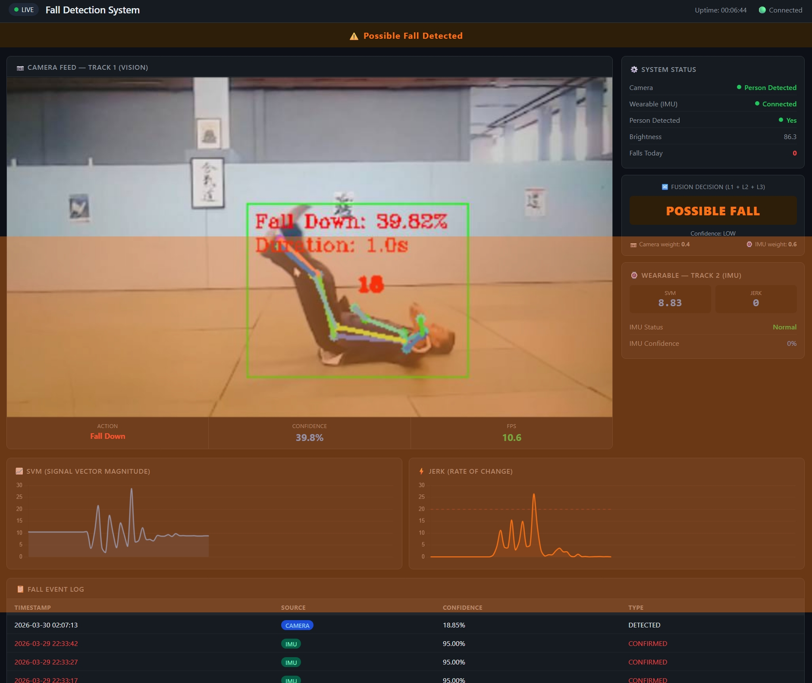
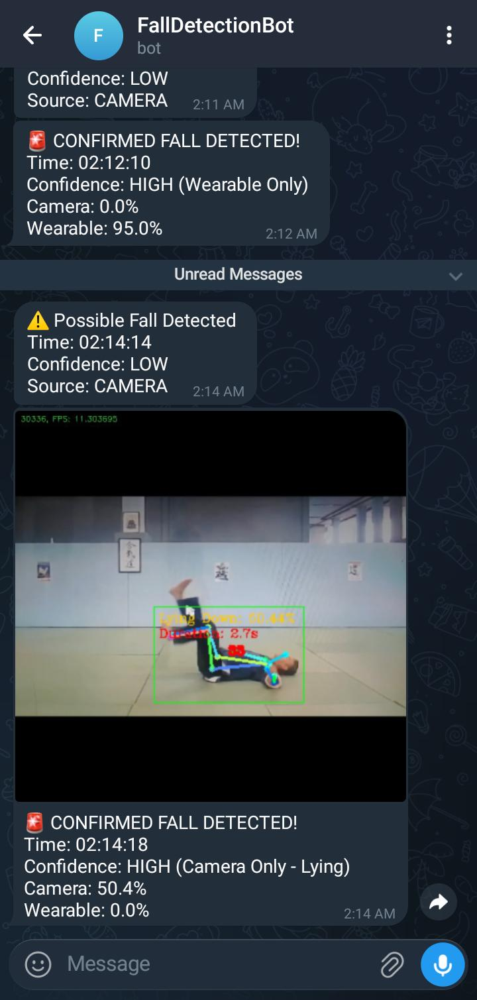

# DualGuard  
### Heterogeneous Dual-Modality Fall Detection via Environment-Adaptive Fusion of ST-GCN Vision and ESP32 Wearable IMU Sensing

DualGuard is a real-time multi-modal fall detection system that combines deep learning-based human action recognition with wearable inertial sensing to improve reliability, reduce false alarms, and ensure timely emergency alerts for elderly monitoring.

The system integrates:
- Vision-based fall detection using Tiny-YOLOv3 + AlphaPose + ST-GCN
- Wearable fall detection using ESP32 + MPU6050 IMU
- Adaptive multi-modal fusion engine
- Real-time Flask dashboard
- Telegram caregiver alert system

---

# Features

- Real-time fall detection
- Dual-modality architecture (Camera + Wearable)
- Adaptive sensor fusion
- Low-light and blind-spot resilience
- Telegram photo alerts
- Live web dashboard
- Automatic graceful degradation
- Event logging and screenshot capture
- Low-cost wearable hardware (< USD 15)

---

# System Architecture

```text
Camera Feed ──► Vision Pipeline ──┐
                                  │
                                  ▼
                           Fusion Engine ──► Alerts & Dashboard
                                  ▲
                                  │
ESP32 + MPU6050 ─► IMU Pipeline ──┘
```

---

# Dashboard Preview



---

# Telegram Alert Preview



---

# Vision Pipeline

The vision pipeline uses:
- Tiny-YOLOv3 for person detection
- AlphaPose for skeleton extraction
- ST-GCN for action recognition

Recognized actions:
- Standing
- Walking
- Sitting
- Lying Down
- Stand Up
- Sit Down
- Fall Down

---

# Wearable IMU Pipeline

The wearable module consists of:
- ESP32 development board
- MPU6050 accelerometer + gyroscope

Detection logic:
- Signal Vector Magnitude (SVM)
- Jerk-based impact detection
- Stillness verification
- TCP streaming over WiFi

---

# Adaptive Fusion Engine

DualGuard uses a custom three-layer adaptive fusion mechanism.

### Layer 1 — Confidence Fusion
Combines confidence scores from both modalities.

### Layer 2 — Temporal Agreement
Verifies both detections occur within a shared time window.

### Layer 3 — Adaptive Weighting
Dynamically adjusts trust weights based on:
- Lighting conditions
- Camera visibility
- IMU connectivity

---

# Experimental Results

| Scenario | Camera Only | IMU Only | DualGuard |
|---|---|---|---|
| Normal Lighting | 93.3% | 90.0% | 96.7% |
| Low Light | 53.3% | 90.0% | 93.3% |
| Blind Spot | 0.0% | 90.0% | 96.7% |
| Overall | 73.3% | 90.0% | 96.7% |

### False Alarm Rate
- Camera Only: 0.0 / 10 min
- IMU Only: 3.2 / 10 min
- DualGuard: 0.4 / 10 min

---

# Hardware Used

## Host System
- Windows 10 Laptop
- NVIDIA GTX 1650 GPU
- Intel Core i5

## Wearable
- ESP32
- MPU6050
- USB Powerbank

## Camera
- Android smartphone with Iriun Webcam

---

# Technologies Used

- Python 3.8
- PyTorch
- OpenCV
- Flask
- Flask-SocketIO
- NumPy
- ESP32 Arduino Framework
- ST-GCN
- AlphaPose

---

# Project Structure

```text
FallDetection_Project/
├── Human-Falling-Detect-Tracks/
├── FallDetection_Track2/
├── FallDetection_Combined/
│   ├── app.py
│   ├── fall_log.csv
│   ├── falls/
│   └── templates/
├── images/
│   ├── dashboard.jpeg
│   └── telegram_alert.jpeg
└── README.md
```

---

# Installation

## Clone Repository

```bash
git clone https://github.com/YOUR_USERNAME/DualGuard.git
cd DualGuard
```

## Create Environment

```bash
conda create -n falldetect python=3.8
conda activate falldetect
```

## Install Dependencies

```bash
pip install -r requirements.txt
```

---

# Running the System

```bash
python app.py
```

Dashboard:
```text
http://localhost:5000
```

---

# SDG Alignment

This project supports SDG 3: Good Health and Well-Being by improving elderly safety through real-time fall detection and rapid emergency alerting.

---

# Credits

The vision pipeline and pretrained model foundations were adapted from:

https://github.com/GajuuzZ/Human-Falling-Detect-Tracks

Full credit for the original Tiny-YOLOv3, AlphaPose integration, and ST-GCN implementation belongs to the original repository authors.

DualGuard extends the original work with:
- ESP32 wearable integration
- Adaptive multi-modal fusion
- Real-time dashboard
- Telegram alert system
- Environmental weighting logic
- Graceful degradation handling

---

# License

This project is intended for academic and research purposes.
